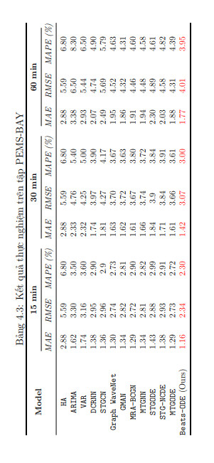

# Project
### Khoá luận tốt nghiệp
#### Giảng viên hướng dẫn: 
- GS.TS Lê Hoài Bắc
- TS. Kiều Vũ Thanh Tùng
#### Sinh viên thực hiện
- Phan Minh Xuân
- Bùi Gia Huy
### MÔ HÌNH KHẢ DIỄN GIẢI CHO BÀI TOÁN GIAO THÔNG TRÊN DỮ LIỆU KHÔNG-THỜI GIAN
#### Tóm tắt: 
Dự báo giao thông là quá trình ước lượng lưu lượng giao thông trên
các tuyến đường và các điểm giao cắt trong một hệ thống giao thông. Mục
tiêu của việc dự đoán này là cung cấp thông tin chi tiết và chính xác về
tình trạng giao thông, giúp quản lý đô thị và người lái xe đưa ra quyết
định thông minh. Trong thập kỷ gần đây, các phương pháp dự đoán giao
thông đã phát triển nhanh chóng, đặc biệt là trong lĩnh vực trí tuệ nhân
tạo mở rộng. Bên cạnh đó, Explainable Artificial Intelligence (XAI) đặt
ra mục tiêu giải quyết vấn đề của việc làm cho mô hình máy học trở nên
minh bạch và dễ giải thích. Trong ngữ cảnh của dự báo giao thông, tính
minh bạch của mô hình là yếu tố quan trọng để tăng cường sự tin tưởng
từ cộng đồng và người sử dụng. XAI trong dự đoán giao thông mang lại
khả năng giải thích về quá trình mô hình hóa và dự đoán, giúp người ta
hiểu rõ hơn về lý do mà một dự đoán cụ thể được đưa ra.
Hiểu được vấn đề đó, trong khoá luận này, chúng em thực hiện đề xuất
một mô hình Beats-ODE dự báo giao thông với các khối N-Beats và lớp
con MTGODE được tích hợp trong mô hình để cải thiện khả năng dự đoán
giao thông. Trong đó, các khối ODE tích chập xếp chồng được sử dụng để
học đặc trưng thời gian, và các khối ODE tích chập đồ thị được áp dụng
để học đặc trưng không gian. Sự sử dụng ODE giúp thông tin truyền từ
lớp này sang lớp khác một cách liên tục, làm tăng độ chính xác của mô
hình. Ngoài ra, chúng em đã kết hợp mô đun dự báo giao thông với một
mô đun giải thích dựa trên cơ chế tối ưu hóa mặt nạ cho bài toán hồi quy.
Chính điều này giúp người dùng có thể tin tưởng vào mô hình hơn, vì họ
có khả năng xem xét các yếu tố quan trọng và hiểu rõ lý do mà mô hình
đưa ra các dự đoán cụ thể. Bên cạnh đó, việc thực hiện thí nghiệm đánh
giá độ chính xác của mô hình của chúng em và phương pháp đối sánh hiện
đại nhất trên hai tập dữ liệu: METR-LA và PEMS-BAY. Qua đó, phương
pháp đề xuất của chúng em có kết quả vượt trội hơn so với các phương
pháp đối sánh.

#### Tập dữ liệu: 
- Sử dụng tập dataset METR-LA và PEMS-BAY, có thể tại và sử dụng tại [Google Drive](https://drive.google.com/drive/folders/10FOTa6HXPqX8Pf5WRoRwcFnW9BrNZEIX)
- Chúng em  thực hiện các bước tiền xử lý dữ liệu giống như trong nghiên cứu của nhóm tác giả trong paper [DCRNN](https://arxiv.org/pdf/1707.01926.pdf)
#### Kết quả: 
- Traffic Forecasting

- XAI

